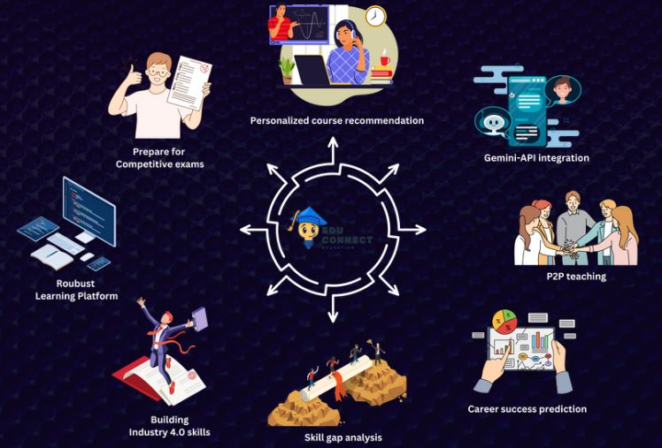

# 🚀 EduConnect - Way To Success 🚀

## Problem Statement 💡

Designing the Future of Learning in India to leverage Industry 4.0 technologies to empower students for competitive and higher education entrance exams. 
Consider AI, real-time data, and interactive experiences to personalize learning journeys and maximize success rates. 
How can technology bridge the gap between traditional education and the needs of tomorrow's workforce?

## Objectives 🎯

- To develop a platform to empower students to excel in competitive exams while bridging the gap between career goals and skills acquisition. 
- To utilize Gemini API to analyze skill gaps and recommend tailored courses.
- To create AI-powered mock tests using fine-tuned Gemini API for personalized exam preparation.
- To provide real-time assistance and guidance powered by fine-tuned Gemini API for users through query analysis of text or image data.
- To foster a dynamic learning environment where peers can engage in collaborative learning through a feature-rich platform enabling video calls, screen sharing, file sharing, session recording, chatting, whiteboarding, etc.
- To develop an AI model to predict the likelihood of admission and career success based on user skills and data analysis.
- To create a secure and robust user interactive platform with engaging learning content and pathways.

## Deliverables 📦

 - **Peer-to-Peer Virtual Discussion Panel:** Create a dynamic platform where students can engage with volunteers from diverse domains and specialized fields. Through realistic virtual classrooms equipped with interactive whiteboards, real-time chat, and live demonstrations, students gain immersive learning experiences from expert educators, accessible from anywhere.

 - **Peer-Based Networks for Enhanced Learning:** Facilitate peer-to-peer interactions among learners, empowering them to form groups and communicate individually. This fosters a collaborative environment for clarifying doubts and enhancing overall learning outcomes.

 - **Personalized Recommendation Engine:** Implement an innovative portal that recommends tailored learning pathways based on user interests and profiles. By integrating data from social platforms like LinkedIn, we identify skill gaps and provide targeted recommendations to bridge them, ensuring users' learning journeys align with their goals.

 - **Predefined Learning Pathways and AI-Powered Mock Exams:** Develop predefined coaching programs for competitive entrance tests such as IIT-JEE, NEET, CAT, SAT, etc. Utilize AI to generate personalized mock exam questions, dynamically adapting to students' learning progress and exam targets, maximizing their preparation efficiency and success rates.

## Features 🌟

## Tech Stack 🛠️

Frontend:
- HTML
- CSS
- ReactJS

Backend:
- Python Flask

Database:
- SQLite

AI Model Training:
- Gradient Boosting Regressor
- Support Vector Regressor
- Lasso Regressor
- Ridge Regressor

APIs Used:
- Gemini API
- LinkedIn API
- Myrocart API

## Novelties 🎯

- **Peer Connection for Collaborative Learning**: By connecting students enrolled in the same courses, we facilitate collaborative discussions, allowing learners to support and learn from each other.

- **AI-Powered Test Score Analysis**: An AI model that analyzes test scores and predicts the probability of admission to higher institutions, providing valuable insights to students about their academic progress and future prospects.

- **Interview Preparation Support**: Our platform offers AI-driven support for interview preparation, addressing doubts and providing guidance to help students succeed in job interviews or admissions interviews.

- **Skill Gap Analysis and Recommendations**: Through AI, we conduct skill gap analyses for users and offer personalized suggestions on the skills needed to achieve their goals, enabling learners to tailor their learning paths accordingly.
  
- **AI based Test Generation** : By generating tests for users to assess themselves, we empower learners to gauge their understanding and progress effectively.

## Team Details 👥
- Vijai Suria M, 3rd year, B.E. CSE, Madras Institute of Technology
- Mugundh J B, 3rd year, B.E. CSE, Madras Institute of Technology
- Siva Jegadeesh C B, 3rd year, B.E. CSE, Madras Institute of Technology
